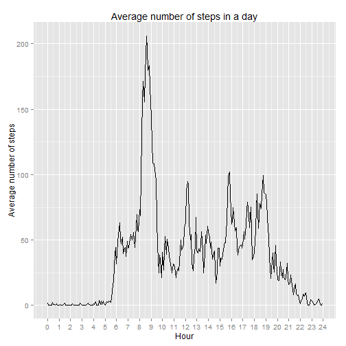
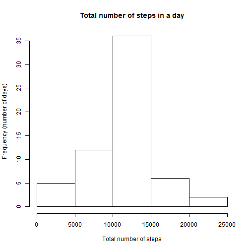
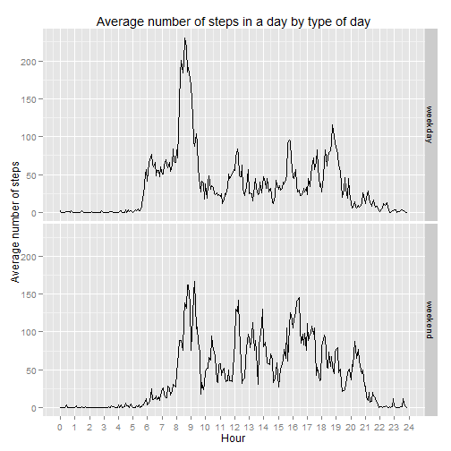

## Loading and preprocessing the data

To begin, the environment is cleaned.

```r
rm(list = ls(all = TRUE))
```

The working directory is set.

```r
setwd("E:\\BIG DATA\\Coursera - Data Scientist\\05 - Reproducible Research\\PA1")
```

The dplyr and ggplot2 libraries will be used for this analyses

```r
library(dplyr)
library(ggplot2)
```

The data is read and put in a dataframe.

```r
dataset = read.csv("activity.csv", stringsAsFactors = FALSE)
```

The interval variable is not continuous, it jumps from 55 to 100 every hour.
So the real number of minutes is calculated to have a continuous variable for time series.

```r
dataset$minutes = floor(dataset$interval / 100) * 60 + (dataset$interval - floor(dataset$interval / 100) * 100)
```

## What is mean total number of steps taken per day?

The dataset is filtered to remove NA records in the step column.

```r
datasetNotNA = filter(dataset, !is.na(dataset$step))
```

Then the total number of steps per day can be calculated after having grouped the dataset by date.

```r
datasetNotNASumDay = select(datasetNotNA, steps, date)
datasetNotNASumDay = group_by(datasetNotNASumDay, date)
datasetNotNASumDay = summarise_each(datasetNotNASumDay, funs(sum))
```

Finally an histogram of total number of steps per day can be plotted.

```r
hist(datasetNotNASumDay$steps,
	xlab = "Total number of steps", 
	ylab = "Frequency", 
	main = "Histogram of total number of steps in a day")
```

 

The mean ans median of total number of steps per day can be calculated.

```r
mean(datasetNotNASumDay$steps)
```

```
## [1] 10766.19
```

```r
median(datasetNotNASumDay$steps)
```

```
## [1] 10765
```

## What is the average daily activity pattern?

The dataset previously filtered to remove NA records can be used.
It can be grouped by minutes interval to calculate the mean of number of steps in each interval.

```r
datasetNotNAMean = select(datasetNotNA, steps, minutes)
datasetNotNAMean = group_by(datasetNotNAMean, minutes)
datasetNotNAMean = summarise_each(datasetNotNAMean, funs(mean))
```

Finally the average number of steps in each minutes interval can be plotted.

```r
plot = qplot(
	minutes,
	steps,
	data = datasetNotNAMean,
	geom = "line",
	xlab = "Interval (hours)",
	ylab = "Average number of steps",
	main = "Average number of steps in a day")
scale_axis =  scale_x_continuous(breaks = seq(0, 24 * 60, 60), labels = 0:24)
plot + scale_axis
```

 

We can observe several values that emerge from others :

- max value at about 8:30 AM with more than 200 steps
- high values at about 12:00 AM, 4:00 PM and 7:00 PM with about 100 steps

We can observe very low values, near 0 steps, between 0:00 AM and 5:00 PM corresponding to a sleeping period.

The minutes interval that corresponds to the maximum number of steps can be retrieved.
It has to be converted to be more readable with hours and minutes.

```r
minutesOfMax = datasetNotNAMean[datasetNotNAMean$steps == max(datasetNotNAMean$steps), ]$minutes
paste(floor(minutesOfMax / 60), minutesOfMax - floor(minutesOfMax / 60) * 60, sep = ":")
```

```
## [1] "8:35"
```

## Imputing missing values

The total number of missing values can be calculated.

```r
datasetNA = dataset[is.na(dataset$steps), ]
nrow(datasetNA)
```

```
## [1] 2304
```

To go further, the distribution of missing values can be shown.

```r
table(datasetNA$date)
```

```
## 
## 2012-10-01 2012-10-08 2012-11-01 2012-11-04 2012-11-09 2012-11-10 
##        288        288        288        288        288        288 
## 2012-11-14 2012-11-30 
##        288        288
```

We can see that missing values are only present in 8 days, and these days only contain missing values.

A strategy can be defined to fill that missing values.
Each missing value in an interval will be replaced by the mean value for this interval.

So the 8 days with no values will be replaced with values of a mean day.

The dataset without NA values will be used to calculate the mean value for each interval.

```r
datasetFillNA = filter(dataset, !is.na(dataset$step))
datasetFillNA = select(datasetFillNA, steps, minutes)
datasetFillNA = group_by(datasetFillNA, minutes)
datasetFillNA = summarise_each(datasetFillNA, funs(mean))
```

The vector of mean values must be repeated on the number of days of observations to retrieve the number of observations of the original dataset.

```r
meanSteps = rep(datasetFillNA$steps, 31 + 30)
```

A new dataset is copied from the original dataset, and the missing values are replaced by the mean values.

```r
datasetFilled = dataset
datasetFilled$steps[is.na(datasetFilled$steps)] = meanSteps[is.na(datasetFilled$steps)]
```

The dataset previously filled can be grouped by date to calculate the total number of steps per day.

```r
datasetFilledSumDay = select(datasetFilled, steps, date)
datasetFilledSumDay = group_by(datasetFilledSumDay, date)
datasetFilledSumDay = summarise_each(datasetFilledSumDay, funs(sum))
```

Finally an histogram of total number of steps per day can be plotted.

```r
hist(datasetFilledSumDay$steps,
	xlab = "Total number of steps", 
	ylab = "Frequency", 
	main = "Total number of steps in a day")
```

 

The mean ans median of total number of steps per day can be calculated.

```r
mean(datasetFilledSumDay$steps)
```

```
## [1] 10766.19
```

```r
median(datasetFilledSumDay$steps)
```

```
## [1] 10766.19
```

We can observe that frequency has increased in the middle of the histogram.
Furthermore, the median value has come closer to mean value.
It corresponds to the fact that days with no values have been filled with mean values.

## Are there differences in activity patterns between weekdays and weekends?

The dataset previously filled can be used.
The day number can be extracted from the date column.

```r
datasetFilledMean = datasetFilled
datasetFilledMean$dayNum = as.numeric(strftime(datasetFilledMean$date, format = "%u"))
```

The day number can be used to retrieve if the day is a week day or a week end day.
This information is converted in a factor.

```r
datasetFilledMean$weekInfo[datasetFilledMean$dayNum <= 5] = "weekday"
datasetFilledMean$weekInfo[datasetFilledMean$dayNum >= 6] = "weekend"
datasetFilledMean$weekInfo = factor(datasetFilledMean$weekInfo)
```

The dataset is grouped by minutes interval and type of day to calculate the mean of number of steps in each type of day.

```r
datasetFilledMean = select(datasetFilledMean, steps, minutes, weekInfo)
datasetFilledMean = group_by(datasetFilledMean, minutes, weekInfo)
datasetFilledMean = summarise_each(datasetFilledMean, funs(mean))
```

Finally the average number of steps in each minutes interval for each type of day can be plotted.

```r
plot = qplot(
	minutes,
	steps,
	data = datasetFilledMean,
	facets = weekInfo ~.,
	geom = "line",
	xlab = "Interval (hours)",
	ylab = "Average number of steps",
	main = "Average number of steps in a day by type of day")
scale_axis =  scale_x_continuous(breaks = seq(0, 24 * 60, 60), labels = 0:24)
plot + scale_axis
```

 

We can observe two different patterns for week days and week end days.

For week days :

- activity starts at about 6:00 AM
- a very high value at about 8:30 AM
- several high values at about 6:00 AM, 12:00 AM, 4:00 PM and 7:00 PM
- activity stops at about 9:00 PM

For week end days :

- activity starts at about 8:00 AM
- high values are more frequent and more uniformly distributed in the day
- activity stops at about 10:00 PM

